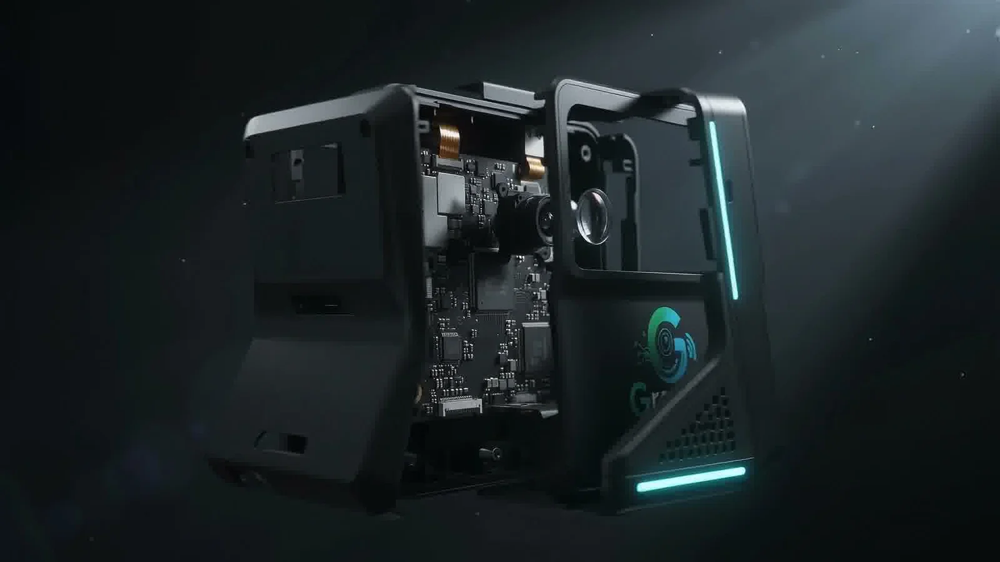
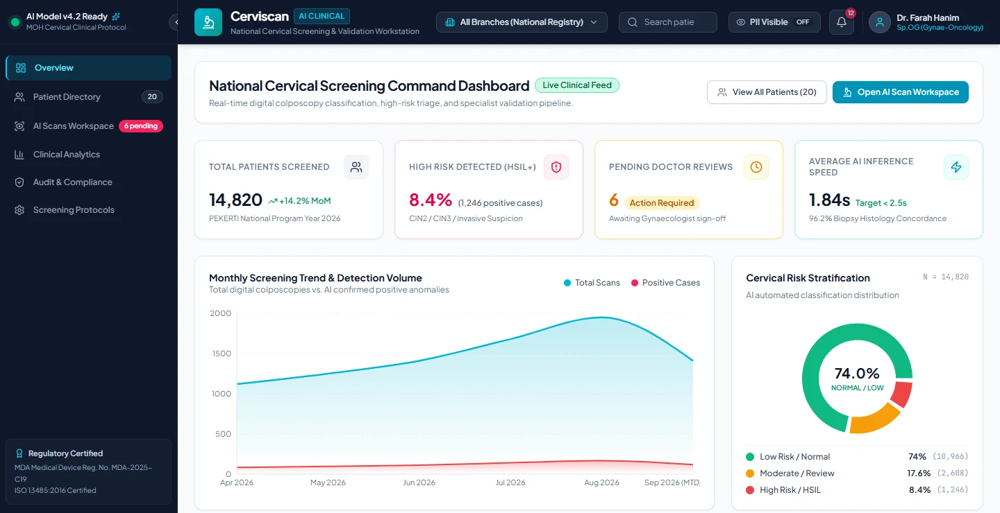
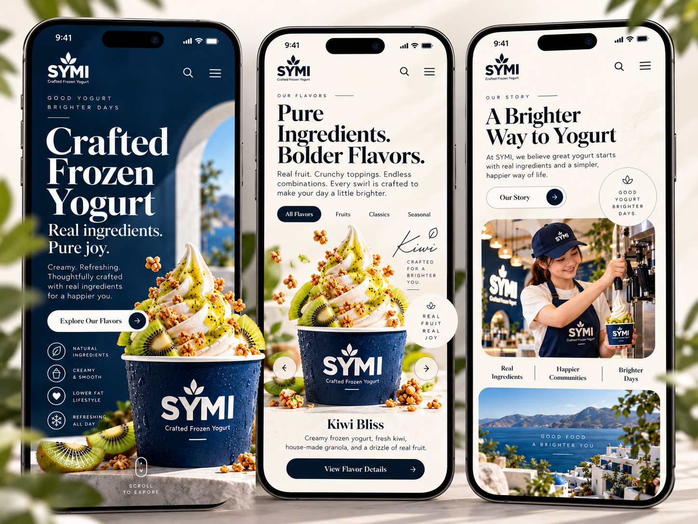
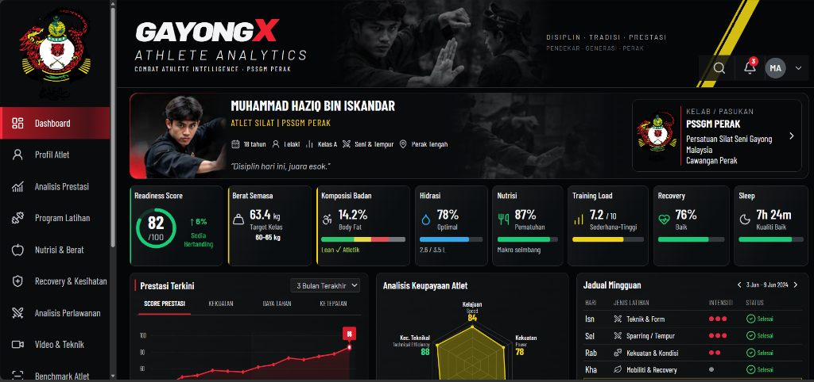

  

  
<strong>Cloud Computing student building connected systems across software, cloud infrastructure, automation and intelligent edge devices.</strong>

  

    
    
    
    
  

## What I build

I work across the path from interface to infrastructure: responsive applications, cloud-connected workflows, deployment, automation and edge devices. My current direction is Cloud and DevOps engineering, supported by hands-on full-stack and AI prototype work.

## Featured work

<table>
  <tr>
    <td width="50%" valign="top">
      
      <h3>Greetly</h3>
      
Edge-to-cloud attendance system connecting Raspberry Pi, OpenCV, Supabase and a realtime Next.js dashboard.

      
<a href="https://syahmiaof.my/projects/greetly">Case study</a> · <a href="https://github.com/syahmiaof/greetly">Source</a> · <a href="https://greetly.syahmiaof.my">Live</a>

    </td>
    <td width="50%" valign="top">
      
      <h3>CerviScan-AI</h3>
      
Team research prototype. I build the CMS dashboard, video stream and YOLOv8 integration for assisted image review.

      
<a href="https://github.com/syahmiaof/CerviScan-AI">Source</a> · <a href="https://cerviscan-ai.syahmiaof.my">Prototype</a>

    </td>
  </tr>
  <tr>
    <td width="50%" valign="top">
      
      <h3>SYMI</h3>
      
Screenshot-driven frontend brand experience with editorial art direction, GSAP motion and responsive interaction design.

      
<a href="https://github.com/syahmiaof/symi">Source</a> · <a href="https://symi.syahmiaof.my">Live</a>

    </td>
    <td width="50%" valign="top">
      
      <h3>GayongX Athlete Analytics</h3>
      
Responsive performance dashboard prototype using typed synthetic data, interactive charts and browser QA.

      
<a href="https://github.com/syahmiaof/gayongx-athlete-analytics">Source</a> · <a href="https://gxaa.syahmiaof.my">Prototype</a>

    </td>
  </tr>
</table>

More builds: [Sistem Aduan Asrama](https://github.com/syahmiaof/sistem-aduan-asrama-ikm) · [Daeng Kuning](https://github.com/syahmiaof/daengkuning) · [GayongX](https://github.com/syahmiaof/gayongx)

## Skills with context

| Area | Used in projects | Building next |
|---|---|---|
| Cloud & delivery | Vercel, Cloudflare, Supabase, Firebase, DigitalOcean | deeper AWS operations and observability |
| Systems & DevOps | Linux, Git, GitHub Actions, systemd, Docker | Kubernetes, Terraform and Ansible workflows |
| Application | Next.js, React, TypeScript, Python, PostgreSQL | stronger testing and service architecture |
| AI & automation | Gemini API, YOLOv8 prototypes, agent workflows, n8n | evaluation, guardrails and production telemetry |
| Edge & IoT | Raspberry Pi, OpenCV, ESP32 concepts | resilient device operations and secure fleet management |

The full evidence map is available on my [Skills & Tech Stack](https://syahmiaof.my/skills) page.

## Verified learning and recognition

Professional programs completed through Coursera include:

- AWS Security Engineer Advanced — Amazon Web Services
- AWS Cloud Solutions Architect Professional Certificate — Amazon Web Services
- Google AI Professional Certificate — Google
- Google IT Support Professional Certificate — Google

Competition recognition:

- Silver Medal — NetAcad Riders International 2026
- Silver Medal — iCompEx International 2026, SMART V-LIGHT
- 4th Place and MVP Team Member — CloudHunt National Competition 2025

These are documented as professional learning programs and competition results. They are not presented as vendor certification exams. View verification details at [syahmiaof.my/credentials](https://syahmiaof.my/credentials).

## Current focus

- Cloud and DevOps engineering foundations
- Reliable deployment, observability and automation
- AI workflows with clear human approval boundaries
- Building products that connect useful interfaces to dependable systems

  

  <a href="https://syahmiaof.my">syahmiaof.my</a> ·
  <a href="https://github.com/syahmiaof">GitHub</a> ·
  <a href="mailto:hello@syahmiaof.my">Email</a>

